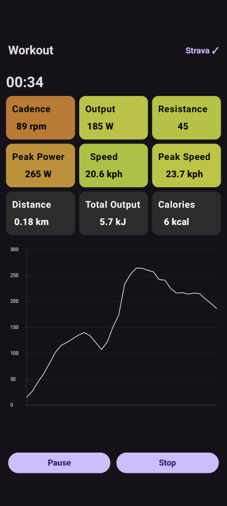
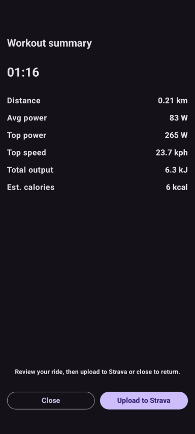

# Peloworkout

A Kotlin/Jetpack Compose Android app for connecting to FTMS-enabled indoor bikes (e.g. Peloton with mods), tracking workout metrics, and uploading sessions to Strava. The app will also sync to any BLE-enabled heart-rate monitor.

This started out as a project to get more out of a subscription-free Peloton which was sitting gathering dust. In theory, it should work with any exercise equipment which broadcasts the right data, but I haven't been able to test this on any other devices (if you try it, I would be curious to know). 

The app itself should work on any Android device (version 7+).

## Screenshots





## Prerequisites

Your bike must broadcast FTMS (Fitness Machine Service) and CSC (Cycling Speed and Cadence) data over Bluetooth LE.
Heart-rate monitor is optional, but can be selected if they broadcast on Bluetooth LE. (For Android Smart-watches, they may not broadcast on BLE by default, but apps such as 'Heart for Bluetooth' installed on the watch can enable this.

### Peloton setup

Peloton bikes do not do this by default.  
To enable FTMS output:

1. Install the [forked Grupetto app](https://github.com/doudar/grupetto) on your Peloton.
2. Use [OpenPelo](https://github.com/doudar/OpenPelo) to sideload the app.
3. Ensure Grupetto is running during your ride so it can stream live metrics.

### Strava integration

To enable Strava uploads:

1. Create an API app in your Strava account at [strava.com/settings/api](https://www.strava.com/settings/api).
2. Note your **Client ID** and **Client Secret**.
3. In your cloned repo, create a file called `secrets.properties` in the app directory and add:

   ```properties
   STRAVA_CLIENT_ID=XXX
   STRAVA_CLIENT_SECRET=XXX

### Features

* Connects to Bluetooth FTMS bikes
* Displays live power, cadence, speed, and resistance
* Displays live heart-rate via Bluetooth heart-rate monitor (optional)
* Tracks total distance and total power for the workout
* Tracks maximum speed and power
* Adaptive estimated calorie burn
  * Uses total power, but blends in heart rate data and optional user profile metrics where available
* Displays a live effort graph for the whole workout
* Displays a workout summary screen
* Uploads workouts to Strava in .tcx format

### Required Permissions

* Bluetooth Scanning
* Bluetooth Connection
* Internet (for Strava integration)

### UX Design Considerations

* Dark Mode / Light Mode switcher. Uses System setting by default
* Forces screen to remain in portrait mode (repainting on rotation causes issues)
* Forces screen to not go to sleep with a Workout is running

### Build

* Android Studio (Giraffe or later)
* Gradle
* Kotlin + Jetpack Compose

### License

MIT